# Virtual memory

## Virtual vs physical address space

- Virtual address space: what the program "thinks" is its memory
- Physical address space: where the program actually is in physical memory

## Base and bounds

### Virtual address space

Linear address space, from $0$ to $\text{MAX}$

### Physical address space

Linear address space, from $\text{BASE}$ to $\text{BOUNDS}$, since memory is shared
- $\text{BASE}$: the starting physical address where your program is loaded
- $\text{BOUNDS}$: how much space it's allowed to use. Usually, $\text{BOUNDS} = \text{BASE} + \text{MAX}$

### MMU

#### Registers

In base and bounds, the MMU utilizes two registers:
- Relocation register: holds the base value, to indicate the MMU _where_ in physical memory the program starts
- Limit register: holds the MAX value, to indicate the MMU the maximum size of the program's memory

#### Flow

Step 1: Validity check

Before translating the address, the MMU makes sure the virtual address is within the following range. If it's outside this range, it's an illegal access, so it triggers a segmentation fault or a trap.

$$
0 \le \text{virtual address} \lt \text{MAX (in limit register)}
$$

Step 2: Address translation

If the virtual address is valid, it's converted into a physical address as follows:

$$
\text{physical address} = \text{base (in relocation register) + virtual address}
$$

### Main memory allocation

- Physical memory is divided into used and unused regions, called _holes_.
- Each hole has a starting address, and a length.
- When a new process is created, the OS needs to find a hole sufficiently large to fit it.
- The OS keeps track of available holes in physical memory through something called a _free list_.
- The OS scans the free list and chooses a hole based on a policy:
    - First-first: pick the first hole that's large enough, which is easy to find
    - Best-fit: pick the smallest hole that's still big enough, so decreases internal fragmentation but leaves smaller leftover holes, which become unusable, thus increases external fragmentation.
    - Worst-fit: picks the largest hole, intentionally leaving behind large remaining chunks of memory

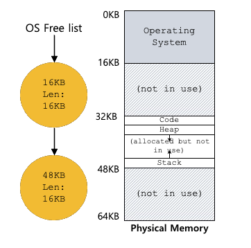

- A particular problem in memory allocation is memory fragmentation, which causes the inability to use free memory.
    - External memory fragmentation: scattered, unallocated space, between blocks
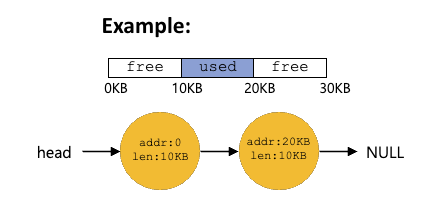
    - Internal memory fragmentation: big chunk of "free" space that takes up physical memory, thus an inefficient use of space within allocated blocks

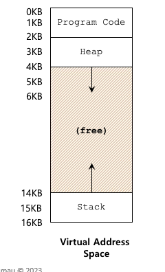

### Context switch

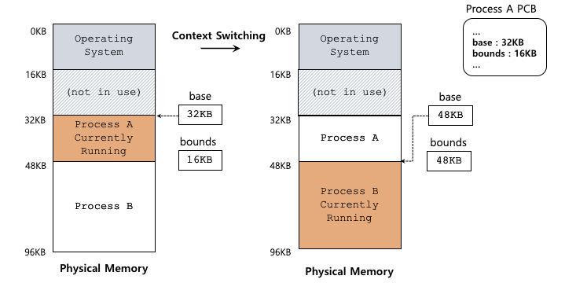

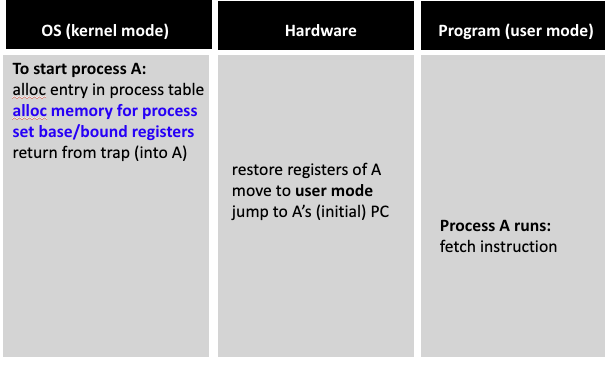

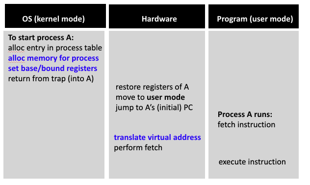

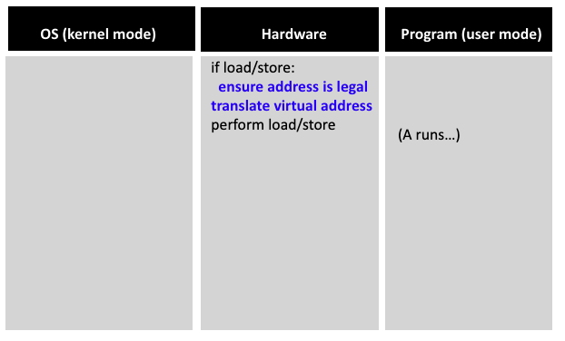

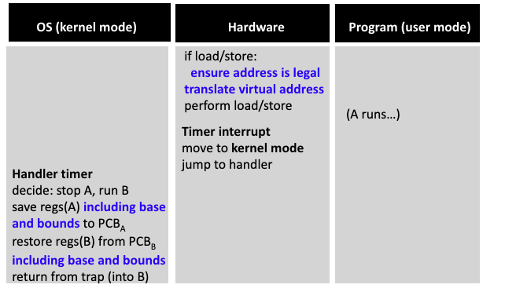

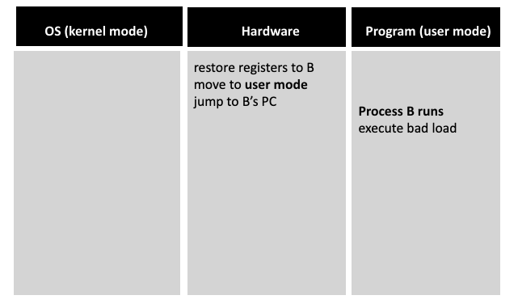

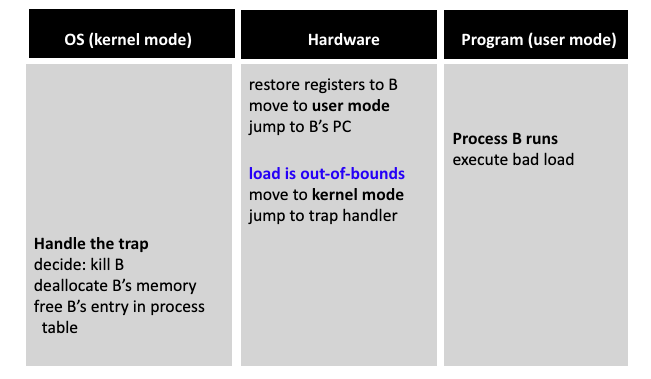

## Segmentation

Segmentation splits a program's memory into distinct linear blocks of memory, called segments, such as a code, stack, or heap segment.

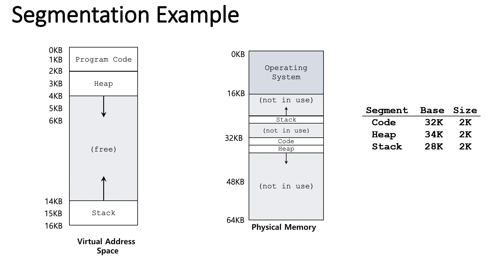

### Virtual address space

- A virtual address of $N$ bits is split into two portions:
    - Segment number ($k$ topmost bit): number that denotes the desired segment
    - Offset ($N - k$ rest of bits): the position within the segment, which can take on values from $0$ to $\text{max segment size} - 1$
- The bit splitting also determines the amount of different segments, and the size per segments
    - $\text{\# of different segments} = 2^k$
    - $\text{max segment size} = 2^{(n - k)} KB$, but in practice, not all segments need to be that big

### Physical address space

Each segment has an associated base and bound
- $\text{BASE}$: starting physical address of the segment
- $\text{BOUND}$: maximum valid offset within the segment

### MMU

Step 1: Take a virtual address in the form $\text{[segment, offset]}$

Step 2: Use the segment number to look up info in the segment table, which is

Step 3: Use the retrieved (base, bound) pair to check if the desired offset is within the bound, and to use the base of the desired segment to translate the virtual address to the physical address as follows

$$
\text{physical address} = \text{base}_\text{segment} + \text{offset}
$$

> [!NOTE]
> Sometimes it’s hardwired into the MMU (fastest), but more often, it’s stored in memory, and if that's the case, it needs:
> - a pointer to the segment table
> - the length of the table (so it doesn’t read out of bounds)

