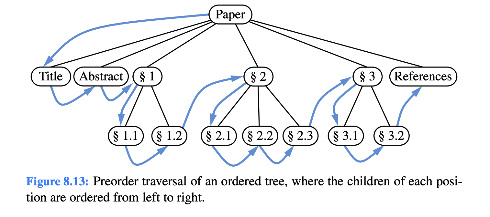
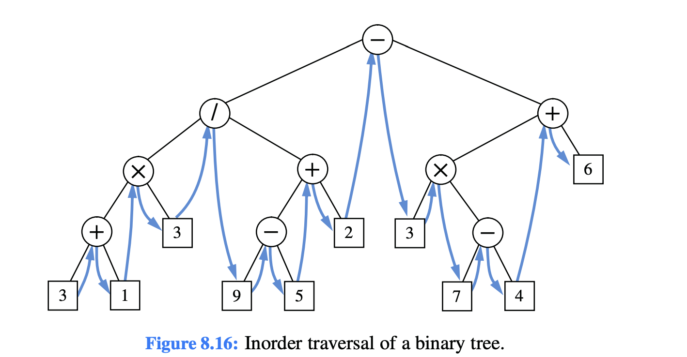
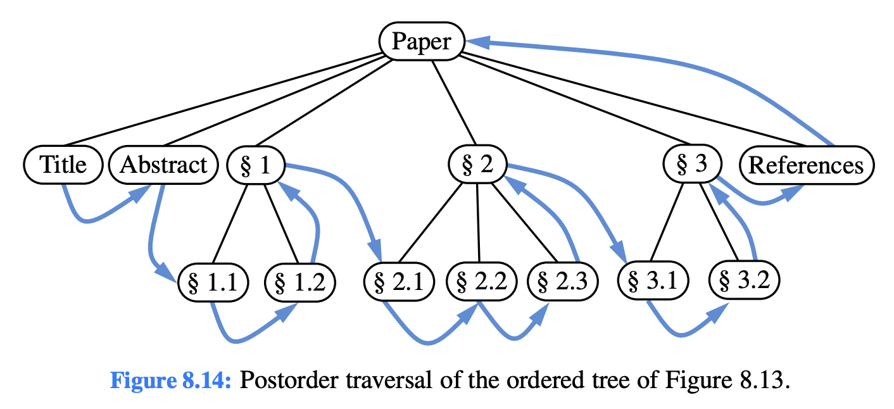
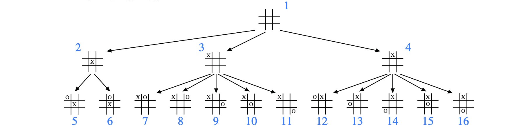

# Tree and graph traversing

## Tree traversing problem

Given the root node of a rooted tree, `root`, traverse the the rooted tree in a pre-order, in-order, post-order, or level-order fashion.

## Tree depth-first search (pre-order, in-order, post-order) algorithm

### Idea

1. Start at the `root` node of the tree
2. For each node, decide when to "visit" it based on the traversal type:
   - Pre-order: Visit the current node before exploring its children
   - In-order: Visit the current node between exploring its left and right children
   - Post-order: Visit the current node after exploring all its children
3. Recursively process the left subtree
4. Recursively process the right subtree
5. Continue until all nodes in the tree have been visited







### Computational complexity

#### Time complexity

Worst-case: $O(n)$

#### Space complexity

Worst-case: $O(n)$

### Pseudocode

#### Pseudocode (pre-order traversal)

```
func recursive_dfs(root: BinaryTreeNode[K]) {
    if root == None {
        return;
    }
    // visit e.g. println("{}", root.key);
    recursive_dfs(root.left);
    recursive_dfs(root.right);
}
```

```
func iterative_dfs(root: BinaryTreeNode[K]) {
    if root == None {
        return;
    }

    var stack: ArrayStack[BinaryTreeNode[K]] = ArrayStack[BinaryTreeNode[K]]::new();
    var current: BinaryTreeNode[K] = root;

    while !stack.is_empty() or current != None {
        if current != None {
            // visit e.g. println("{}", current.key);
            stack.push(current.right);
            current = current.left;
        } else {
            current = stack.pop();
        }
    }
}
```

#### Pseudocode (in-order traversal)

```
func recursive_dfs(root: BinaryTreeNode[K]) {
    if root == None {
        return;
    }
    recursive_dfs(root.left);
    // visit e.g. println("{}", root.key);
    recursive_dfs(root.right);
}
```

```
func iterative_dfs(root: BinaryTreeNode[K]) {
    if root == None {
        return;
    }

    var stack: ArrayStack[BinaryTreeNode[K]] = ArrayStack[BinaryTreeNode[K]]::new();
    var current: BinaryTreeNode[K] = root;

    while !stack.is_empty() or current != None {
        if current != None {
            stack.push(current);
            current = current.left;
        } else {
            current = stack.pop();
            // visit e.g. println("{}", current.key);
            current = current.right;
        }
    }
}
```

#### Pseudocode (post-order traversal)

```
func recursive_dfs(root: BinaryTreeNode[K]) {
    if root == None {
        return;
    }
    recursive_dfs(root.left);
    recursive_dfs(root.right);
    // visit e.g. println("{}", root.key);
}
```

```
func iterative_dfs(root: BinaryTreeNode[K]) {
    if root == None {
        return;
    }

    var stack: ArrayStack[BinaryTreeNode[K]] = ArrayStack[BinaryTreeNode[K]]::new();
    var current: BinaryTreeNode[K] = root;
    var last_visited: BinaryTreeNode[K] = None;

    while !stack.is_empty() or current != None {
        if current != None {
            stack.push(current);
            current = current.left;
        } else {
            var peek_node: BinaryTreeNode[K] = stack.top();

            if peek_node.right != None and peek_node.right != last_visited {
                current = peek_node.right;
            } else {
                // visit e.g. println("{}", peek_node.key);
                last_visited = stack.pop();
                current = None;
            }
        }
    }
}
```

## Tree breadth-first search (level-order) algorithm

### Idea

1. Start at the `root` node of the tree
2. Create a queue and enqueue the `root` node
3. While the queue is not empty:
   - a. Dequeue a node and visit it
   - b. Enqueue all of the node's children (first left, then right)
4. Continue until the queue is empty and all nodes have been visited



### Computational complexity

#### Time complexity

Worst-case: $O(n)$

#### Space complexity

Worst-case: $O(n)$

### Pseudocode

```
func iterative_bfs(root: BinaryTreeNode[K]) {
    if root == None {
        return;
    }

    queue: ArrayQueue[BinaryTreeNode[K]] = ArrayQueue[BinaryTreeNode[K]]::new();
    queue.enqueue(root);

    while !queue.is_empty() {
        var current: BinaryTreeNode[K] = queue.dequeue();
        // visit e.g. println("{}", current.key);
        if current.left != None {
            queue.enqueue(current.left);
        }
        if current.right != None {
            queue.enqueue(current.right);
        }
    }
}
```

## Graph traversing problem

Given a graph, `graph`, and a source node of `graph`, `source`, traverse `graph` beginning at the `source`.

## Graph depth-first search

### Idea

1. Create a container (typically a set) to keep track of visited nodes
2. Start at `source` and mark it as visited
3. For each unvisited neighbor of the current vertex:
    - a. Recursively apply the depth-first search on that neighbor
    - b. Mark the neighbor as visited
4. Backtrack when a vertex has no unvisited neighbors
5. Continue until all reachable vertices from `source` have been visited


### Computational complexity

#### Time complexity

Worst-case: $O(|V| + |E|)$

#### Space complexity

Worst-case: $O(V)$

### Pseudocode

#### Pseudocode (iterative)

```
func iterative_dfs(graph: AdjacencyListGraph[V, E], source: V) {
    var visited: HashSet[V] = HashSet[V]::new();
    var stack: ArrayStack[V] = ArrayStack[V]::new();

    stack.push(source);
    visited.add(source);

    while !stack.is_empty() {
        var vertex: V = stack.pop();
        if !visited.contains(vertex) {
            visited.add(vertex);
            for neighbor in graph.get_neighbors(vertex) {
                stack.push(neighbor);
            }
        }
    }
}
```

#### Pseudocode (recursive)

```
func recursive_dfs(graph: AdjacencyListGraph[V, E], vertex: V, visited: HashSet[V]) {
    visited.add(vertex);

    for neighbor in graph.get_neighbors(vertex) {
        if !visited.contains(neighbor) {
            recursive_dfs(graph, neighbor, visited);
        }
    }
}
```

## Graph breadth-first search

### Idea

1. Start at the source vertex `source`
2. Explore all the neighbors of `source`
3. Then explore all the unvisited neighbors of the neighbors of `source`
4. Then explore all the unvisited neighbors of the neighbors of the neighbors of `source`
5. Repeat until no more unvisited vertices remain


### Computational complexity

#### Time complexity

Worst-case: $O(|V| + |E|)$

#### Space complexity

Worst-case: $O(V)$

### Pseudocode

```
func iterative_bfs(graph: AdjacencyListGraph[V, E], source: V) {
    var visited: HashSet[V] = HashSet[V]::new();
    var queue: ArrayQueue[V] = ArrayQueue[V]::new();

    queue.enqueue(source);
    visited.add(source);

    while !queue.is_empty() {
        var vertex: V = queue.dequeue();
        for neighbor in graph.get_neighbors(vertex) {
            if !visited.contains(neighbor) {
                visited.add(neighbor);
                queue.enqueue(neighbor);
            }
        }
    }
}
```
