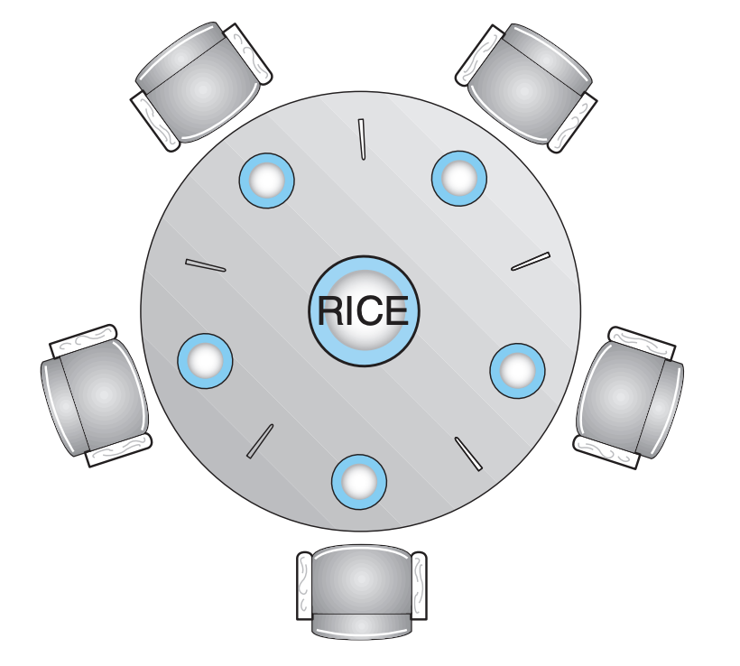

# Classic concurrency problems

## Producer-consumer/bounded-buffer problem

### Description

TO DO

### Solution

#### Anatomy

- The conditional variable is used to notify the consumer that there are items in the buffer to process
- The predicate expression is necessary to "save" the signal, Otherwise, if all consumer threads are busy processing when the producer adds a new item and signals, the signal will be missed and forgotten, and when the consumer threads are done their work, they will be incorrectly waiting, despite their being more items to process.
- The mutual exclusion lock is used to prevent data races on the shared data (in this case, the buffer, and the predication expression variable). For example, in a scenario with a single producer and a single consumer, the consumer thread might check the predicate expression to see that there are no items in the buffer. Then, the scheduler may perform a a context switch, which switches the running task to the producer, that'll modify the predication expression and signal, followed by another context switch back to the consumer thread, which misses the signal, and proceeds with the call to `cond_var.wait(mutex)` when the producer had produced an item.
- The while loop is necessary with the predicate expression as the condition (over a simple if statement) because it's possible that when the consumer thread unblocks on the condition variable, and attempts to re-acquire the mutual exclusion lock, a different consumer thread may instead acquire it and consume (i.e. dequeue an item from the buffer and process it), therefore modifying the the predicate_expression. Hence, the predicate_expression must be checked again, and the consumer thread that did not manage to re-acquire the mutex lock must wait again. Otherwise, it would proceed when it shouldn't.

#### Pseudocode

```
var mutex: Mutex = Mutex::new();
var cond_var: CondVar = CondVar::new();

func producer() {
    mutex.lock();
    // Change shared state
    predicate_expression = true;
    cond_var.signal();
    mutex.unlock;
}

func consumer() {
    mutex.lock();
    while !predicate_expression {
        cond_var.wait(mutex);
    }
    // The predicate is now true, do work
    mutex.unlock();
}
```

## Dining philosopher's problem

### Description

Five philosophers are sitting at a circular table. Each philosopher are either eating, which requires two chopsticks, or are thinking, but they can't both be eating and thinking at the same time.

There are also some constraints rules:
- Philosophers can't speak to each other
- Philosophers can only pick up on chopstick at a time
- Philosophers can only pick up adjacent chopsticks

How can we design a solution such that no philosopher will starve, i.e. each can forever continue to alternate between eating and thinking?



### Solution

#### Reduce philosophers

Allow at most four philosophers to be sitting simultaneously at the table.

#### Two chopsticks only

Allow a philosopher to pick up her chopsticks only if both chopsticks are available (to do this, she must pick them up in a critical section).

#### Asymmetric solution

- Assign odd and even IDs to philosophers
- An odd philosopher picks up first left chopstick, and then the right chopstick
- An even philosopher picks up her right chopstick, and then the left chopstick

## Readers–writers problem


